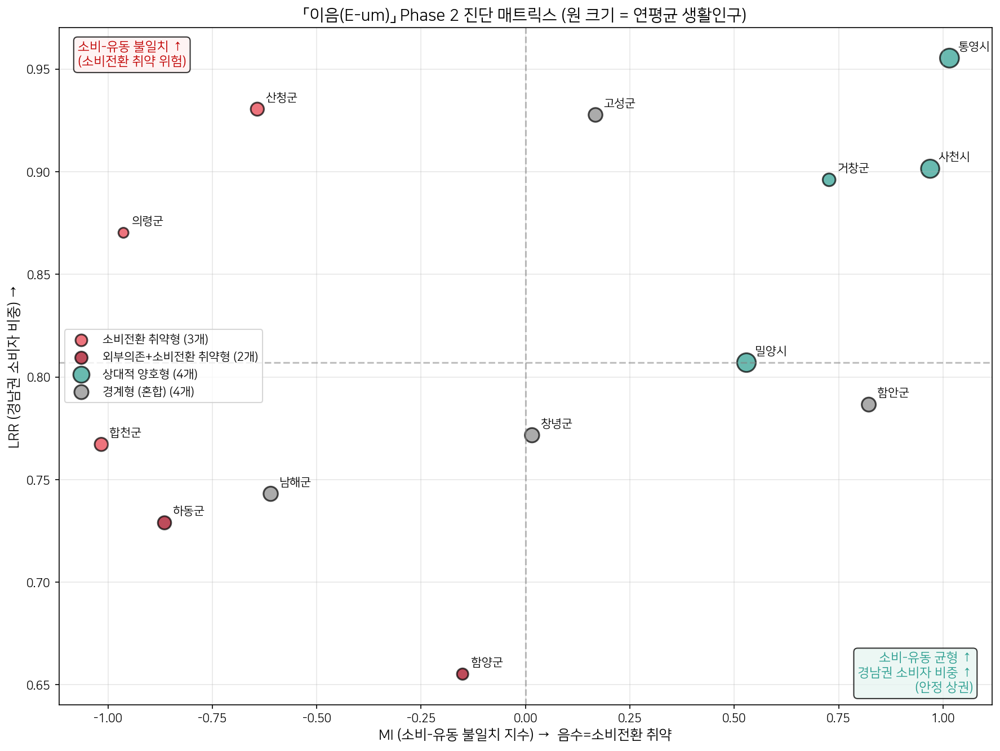
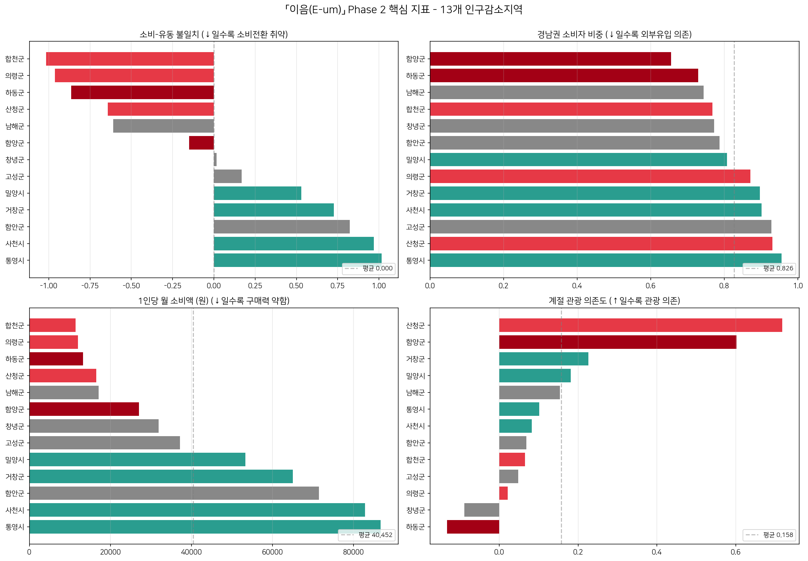
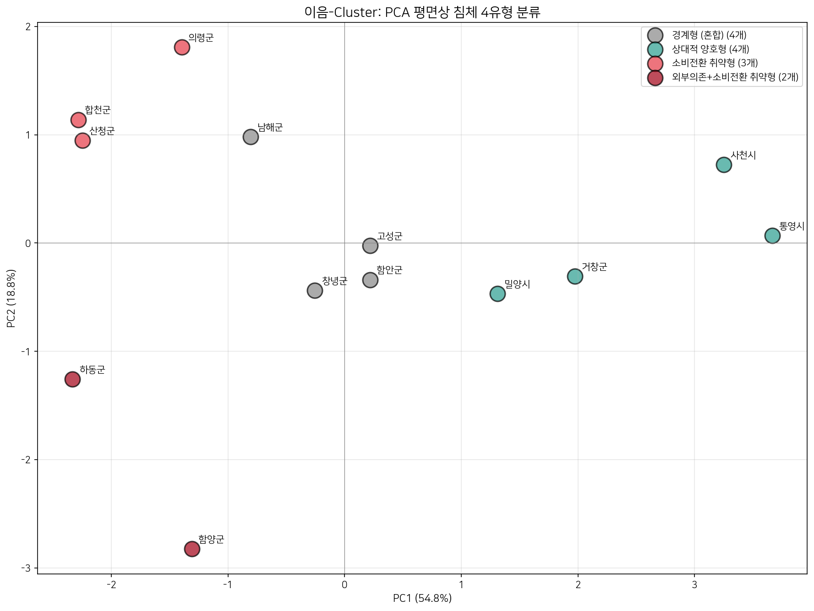
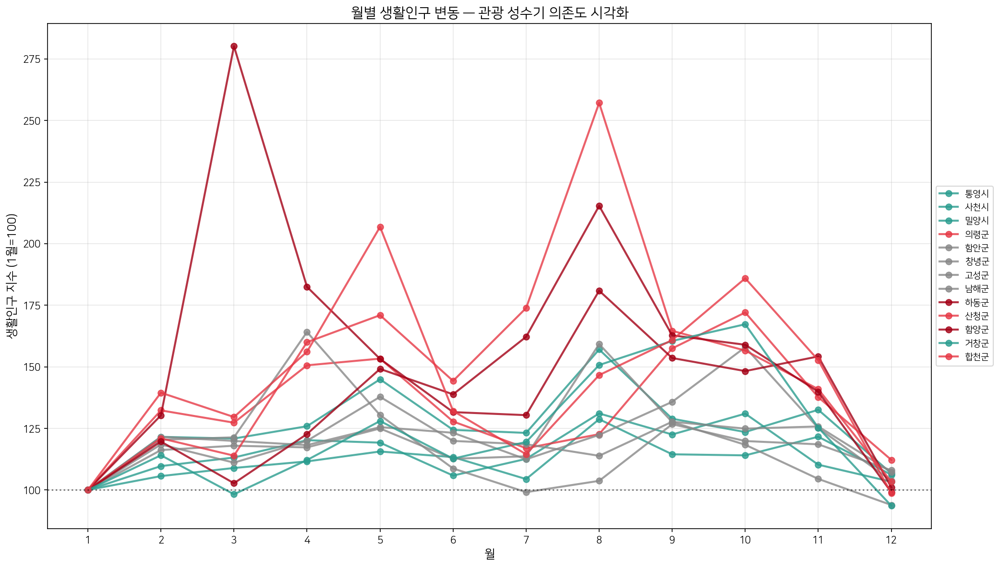
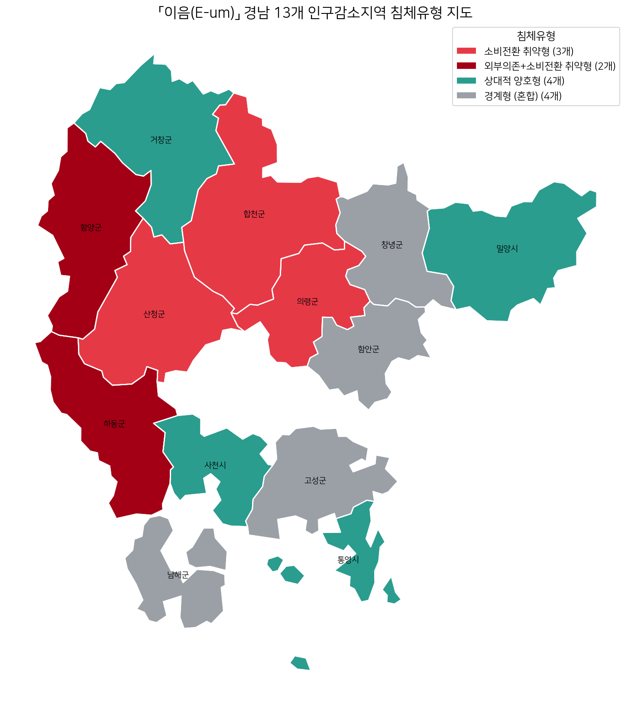
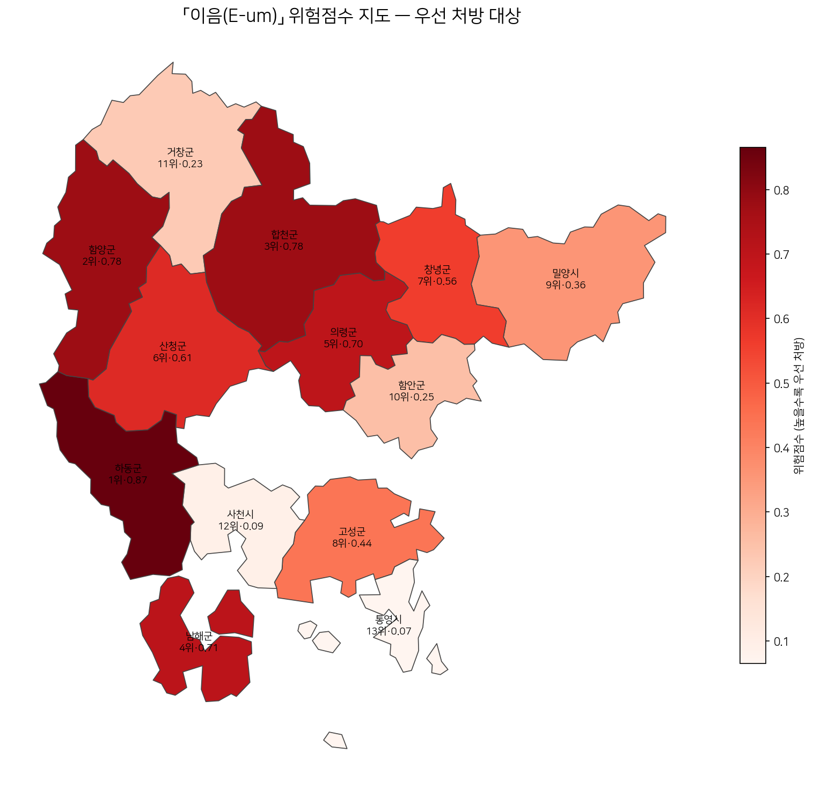
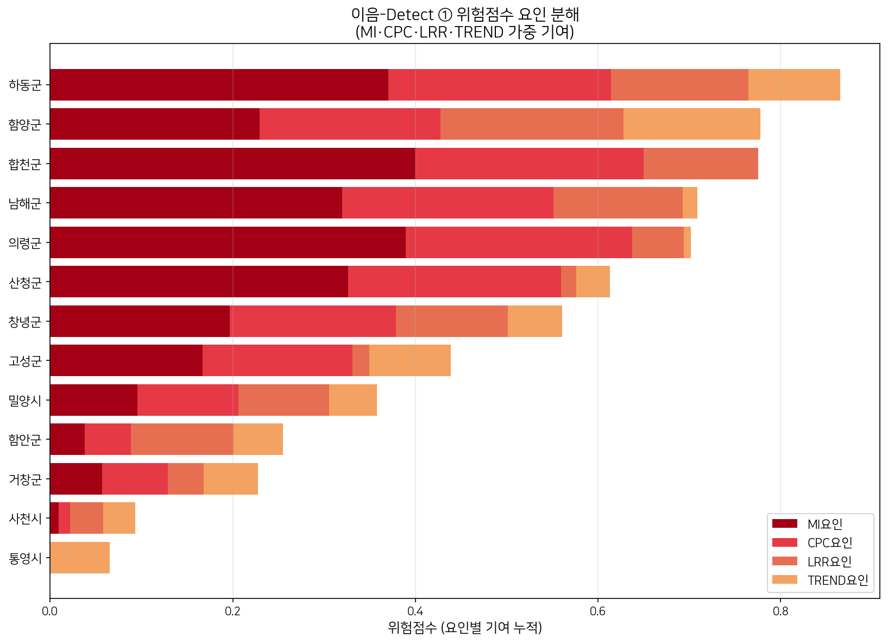
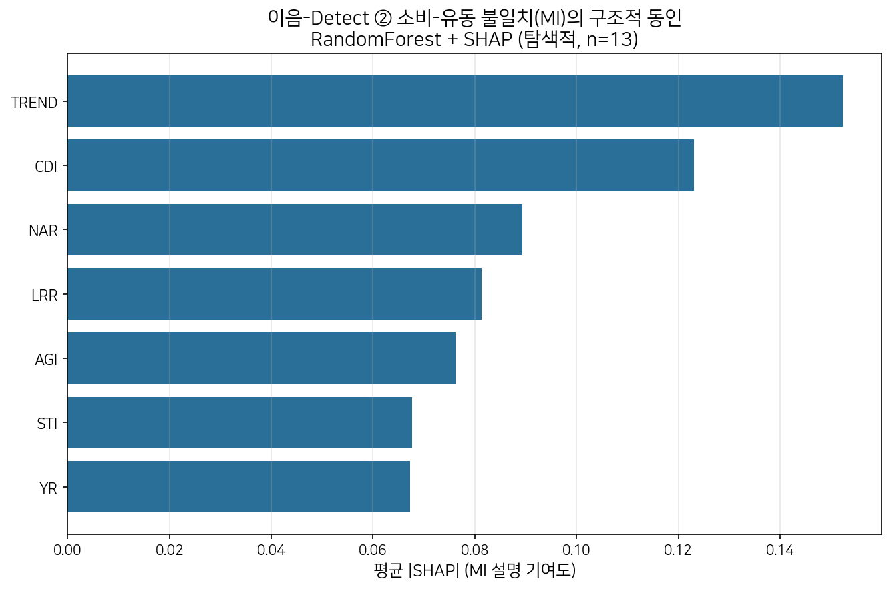
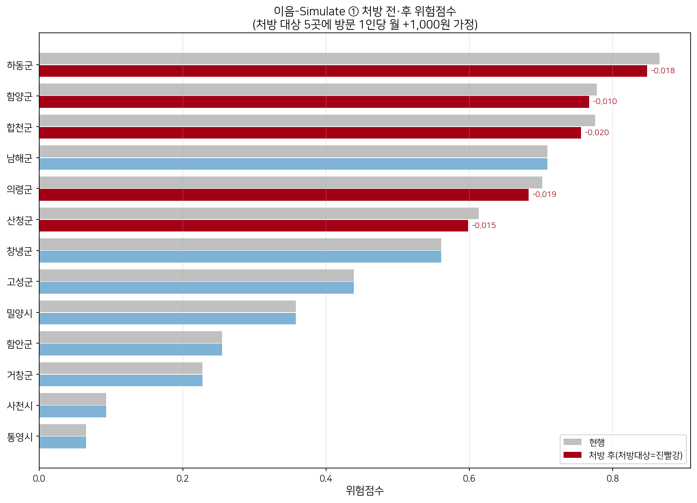

# 이음(E-um): 생활인구는 왜 지역 소비로 이어지지 않는가
## — 경남 인구감소지역의 소비-유동 불일치 진단과 유형별 처방

> 2026년 경상남도 빅데이터 활용 공모전 (1부문: 빅데이터 분석) 제출용 분석보고서 초안 v1
>
> 분석 대상: 경남 13개 인구감소·관심지역 | 데이터: 2024년 카드매출 3종 + KOSIS 생활인구

---

## 1. 개요 — 문제 제기

경남 인구감소지역 상권 정책은 오랫동안 **"사람이 없으니 상권이 죽는다"**는 전제 위에 있었다.
그러나 이 전제는 현실의 절반만 설명한다. 어떤 지역은 관광·계절 유입으로 방문 인구가 적지 않은데도
지역 소비가 일어나지 않고, 어떤 지역은 외부 방문객에 기댄 구조에서 매출이 오히려 줄고 있다.

본 연구의 핵심 질문은 다음과 같다.

> **"문제는 사람이 없는 것인가, 아니면 있는 사람이 소비로 이어지지 않는 것인가?"**

이를 데이터로 답하기 위해, 우리는 **카드매출(실제 소비)**과 **생활인구(실제 방문 흐름)**를 결합하여
*생활인구가 지역 소비로 전환되는 정도*를 정량화하는 진단 모델 **「이음(E-um)」**을 설계했다.
핵심 지표는 소비-유동 불일치 지수 **MI(Mismatch Index)**이다.

E-um은 13개 지역을 (1) 통계적으로 **유형화**하고, (2) 유형별 **원인을 분리**하며,
(3) 가진 데이터 안에서 **실행 가능한 처방과 기대효과**까지 제시한다.

---

## 2. 데이터 및 전처리

### 2.1 수집 데이터

| 데이터 | 파일 | 출처 | 용도(지표) |
|---|---|---|---|
| 월별 카드매출 | 2024년 경상남도 지역별 월별 카드매출현황 | 경남 빅데이터 허브플랫폼 | LRR·CDI·TREND·연간매출 |
| 시간대별 카드매출 | 〃 시간대별 | 〃 | NAR |
| 성연령별 카드매출 | 〃 성연령별 | 〃 | AGI·YR |
| 생활인구 | 101_DT_1YL12002E (인구감소지역 생활인구) | KOSIS(통계청·행안부, 통신3사 기반) | MI·CPC·STI |
| 행정경계 | 시군구 행정경계 (시각화용) | 통계청 KOSTAT 시군구 경계 | 침체유형·위험점수 지도 |

- 모든 카드 CSV 인코딩: `cp949`. 시군구명 표기 변형은 표준화 사전으로 통일.
- 생활인구: 「월 1회 이상 3시간 이상 체류한 인구의 월별 합계」(2024.1~12), wide→long 변환 후 연령 합계(계) 사용.
- 2025년 기준 폐지/결측 항목 및 지역 미매칭 항목 제외.

### 2.2 분석 대상 13개 시·군

- **인구감소지역(11)**: 밀양·의령·함안·창녕·고성·남해·하동·산청·함양·거창·합천
- **관심지역(2)**: 통영·사천

> 경남 22개 시군구 전수(Phase 1)를 먼저 분석한 뒤, 생활인구 결합이 가능한 13개 지역(Phase 2)으로
> 범위를 좁혀 정밀 진단했다. 보고서의 중심은 Phase 2다.

### 2.3 분석 환경

Python 3 (pandas, scikit-learn, matplotlib, geopandas, shap). K-means·RandomForest 모두
`random_state=42` 고정으로 재현성 확보.

---

## 3. 핵심 지표 정의

| 지표 | 정의 | 해석 |
|---|---|---|
| **★ MI** | log(연간매출 / 연평균 생활인구) − 13곳 평균 | **음수 = 유동 대비 소비 부진(소비전환 취약)** |
| **★ CPC** | 연간매출 / 생활인구 / 12 | 방문 1인당 월 소비 흡수력 |
| **★ STI** | 성수기(6~8월)/비수기(1~3월) 생활인구 − 1 | 높음 = 관광·계절 유입 의존 |
| LRR | 유입지가 경남인 매출 / 전체 매출 | **경남권 소비자 비중** (낮음 = 외부유입 소비 의존) |
| CDI | 업종별 매출의 Shannon Entropy | 낮음 = 업종 집중 |
| NAR | 18~23시 매출 / 전체 | 낮음 = 야간 체류 약함 |
| AGI | 60대+ 매출 비중 | 높음 = 고령 소비 의존 |
| YR | 20~30대 매출 비중 | 낮음 = 청년 소비 이탈 |
| TREND | 월별 매출 회귀 기울기 / 평균 | 음수 = 2024년 내 감소세 |

★ = 생활인구 결합으로 새로 가능해진 본 연구의 핵심 지표.

> **해석 주의(LRR):** 낮은 LRR은 "자금 유출/출혈"이 **아니라** 해당 지역 매출 중 경남 외
> 소비자 비중이 높다는 의미, 즉 **외부유입 소비 의존** 특성이다.

### 3.1 지표·산식 설계 근거

- **MI·CPC (생활인구 대비 소비):** 생활인구는 통근·통학·관광 등 실제 체류 흐름의 합계로,
  「인구감소지역 지원 특별법」(2022) 이후 정주인구를 보완하는 공식 지표로 산정된다. 통계청
  「인구감소지역과 생활밀접업종 관계 분석」은 생활인구가 지역 소비(생활밀접업종 매출)와
  체계적으로 연동됨을 보였다. 본 연구의 MI·CPC는 *이 연동이 지역별로 얼마나 약한가*를
  로그 비율로 정량화한 것으로, 분모를 정주인구가 아닌 생활인구로 둔 점이 핵심 차별점이다.
- **CDI (Shannon Entropy):** 업종 매출 분포의 집중도를 정보 엔트로피로 측정한다(Shannon, 1948).
  값이 낮을수록 소수 업종 의존이 커 외부 충격에 취약하다.
- **위험점수 가중치(0.40·0.25·0.20·0.15):** 핵심 가설(소비-유동 불일치)을 직접 측정하는 MI에
  최대 비중을, 구매력(CPC)에 차순위를 부여했다. 외부의존(LRR)·추세(TREND)는 방향성을 반영하되
  보조 비중으로 두었다. 이 가중 구조의 타당성은 **4.6 이음-Detect Part ①**에서 위험 상위
  시군 전부가 MI 1위 요인으로 분해됨으로써 사후 검증된다.

---

## 4. 분석 결과

### 4.1 13개 지역 핵심 지표

| 지역 | MI | CPC(원/월) | STI | LRR | TREND | 침체유형 | 위험점수 |
|---|---|---|---|---|---|---|---|
| 하동군 | −0.865 | 13,240 | −0.132 | 0.729 | −0.004 | 외부의존+소비전환 취약 | **0.865** |
| 함양군 | −0.151 | 27,037 | 0.602 | **0.655** | **−0.014** | 외부의존+소비전환 취약 | 0.778 |
| 합천군 | **−1.016** | **11,380** | 0.065 | 0.767 | 0.016 | 소비전환 취약 | 0.775 |
| 남해군 | −0.610 | 17,074 | 0.154 | 0.743 | 0.013 | 경계형 | 0.709 |
| 의령군 | −0.963 | 12,001 | 0.022 | 0.870 | 0.015 | 소비전환 취약 | 0.702 |
| 산청군 | −0.642 | 16,536 | **0.718** | 0.930 | 0.009 | 소비전환 취약 | 0.613 |
| 창녕군 | 0.016 | 31,927 | −0.088 | 0.772 | 0.004 | 경계형 | 0.561 |
| 고성군 | 0.168 | 37,170 | 0.048 | 0.928 | −0.002 | 경계형 | 0.439 |
| 밀양시 | 0.529 | 53,357 | 0.182 | 0.807 | 0.006 | 상대적 양호 | 0.358 |
| 함안군 | 0.822 | 71,516 | 0.069 | 0.787 | 0.005 | 경계형 | 0.255 |
| 거창군 | 0.727 | 65,036 | 0.226 | 0.896 | 0.004 | 상대적 양호 | 0.227 |
| 사천시 | 0.969 | 82,844 | 0.083 | 0.901 | 0.009 | 상대적 양호 | 0.093 |
| 통영시 | **1.015** | **86,764** | 0.101 | 0.955 | 0.003 | 상대적 양호 | 0.065 |

> **위험점수 산식:** 위험점수 = 0.40·MI′ + 0.25·CPC′ + 0.20·LRR′ + 0.15·TREND′
> (각 지표를 13개 지역 min-max 정규화하고, 낮을수록 위험인 지표는 부호 반전).
> 가중치는 핵심 가설인 소비-유동 불일치(MI)에 최대 비중을 부여했다.

### 4.2 핵심 발견 ① — 인구감소지역 안에도 "양극화"가 있다

13개 지역의 MI·CPC는 **극단적으로 갈린다**. CPC 최저 합천(11,380원)과 최고 통영(86,764원)은
**7.6배** 차이다. 같은 인구감소지역, 심지어 같은 군(郡) 단위인데도 거창(65,036원)과
합천(11,380원)은 5.7배 차이가 난다.

→ *"인구감소지역 = 일률적 침체"라는 통념을 데이터로 반박*한다. 처방도 일률적일 수 없다.

> **그림 1. MI × LRR 진단 매트릭스** — 소비전환 정도(MI)와 외부유입 의존(LRR)의 2차원 위치
>
> 

### 4.3 핵심 발견 ② — "소비전환 취약형"은 우연이 아니다 (n=3)

K-means 군집(탐색적 유형화) 결과, **소비전환 취약형(산청·의령·합천)** 세 지역이
**MI 전부 < −0.6, CPC 전부 < 17,000원**이라는 동일 증상으로 묶였다. 세 지역이 서로의 증상을
교차 입증하므로, 이는 단일 사례가 아니라 **반복되는 패턴**이다.

> **그림 2. 유형별 지표 비교** / **그림 3. PCA 군집 시각화**
>
> 
>
> 

### 4.4 핵심 발견 ③ — 산청: 관광객은 오는데 소비가 없다

산청은 성수기 생활인구가 비수기 대비 **72% 증가(STI 0.718, 13곳 최고)**하지만 MI는 음수다.
야간 매출(NAR 0.192)도 낮다. 즉 **"낮에 왔다 그냥 가는 통과형"** 관광 구조다. 방문은 폭증하는데
지역 소비로 전환되지 않는, MI 모델이 아니면 보이지 않는 현상이다.

> **그림 4. 월별 생활인구 추세 (계절성)**
>
> 

### 4.5 공간 분포 — 침체유형·위험점수 지도

13개 지역의 진단 결과를 경남 행정경계(통계청 시군구 경계) 위에 투영하면, 침체가
**서부 내륙(하동·함양·산청·합천·의령)에 띠처럼 연속 분포**함이 드러난다. 단발 사례가
아니라 **공간적으로 인접한 구조적 침체 벨트**라는 점은 광역 단위 처방의 근거가 된다.
반대로 해안·도심 접근성이 좋은 통영·사천·밀양은 상대적 양호형으로 분리된다.

> **그림 5. 침체유형 지도** / **그림 6. 위험점수 지도 (라벨 = 순위·점수)**
>
> 
>
> 

### 4.6 이음-Detect — 침체 원인 정량 분해

진단을 "어디가 위험한가"에서 **"무엇 때문에 위험한가"**로 끌어내리기 위해, 원인을
두 층위로 분해했다.

**① 위험점수 요인 분해 (정확 분해).** 위험점수는 4개 지표의 가중합이므로, 각 시군의
점수를 MI·CPC·LRR·TREND 기여항으로 정확히 나눌 수 있다(재현 오차 0). 그 결과
**위험 상위 8개 시군 전부에서 MI(소비-유동 불일치)가 1위 요인**(기여율 30~56%)으로
나타나, 본 연구의 핵심 가설 — *침체의 축은 인구가 아니라 소비전환 실패* — 이 정량적으로
재확인된다. 반면 상대적 양호군(밀양·거창)은 CPC, 통영은 TREND가 잔여 위험의 주축이다.

> **그림 7. 위험점수 요인 분해**
>
> 

**② MI의 구조적 동인 (RandomForest + SHAP, 탐색적).** 그렇다면 *소비전환 실패 자체는
무엇과 연관되는가?* MI를 종속변수로, 산식에 포함되지 않은 구조지표
(LRR·CDI·NAR·AGI·YR·STI·TREND)를 독립변수로 RandomForest 회귀를 적합하고 SHAP으로
기여도를 분해했다. 전역 기여도는 **TREND(매출 감소세) > CDI(업종 집중) > NAR(야간 약함)**
순으로, 소비-유동 불일치는 *추세 악화·업종 편중·야간 상권 부재*와 가장 강하게 결부됨을
시사한다. 시군별로 보면 합천·남해·의령은 TREND(감소세), 하동은 NAR(야간 약함),
함양·산청은 CDI(업종 집중)가 MI를 끌어내리는 1순위 동인으로 분리되어, **유형 내에서도
처방의 우선순위가 달라야 함**을 뒷받침한다.

> **그림 8. MI의 구조적 동인 (SHAP 전역 기여도)**
>
> 

> **해석 주의:** Part ②는 표본 n=13의 **탐색적 기여도 분해**다. 확정적 인과가 아니라
> 처방 우선순위를 좁히기 위한 패턴 탐지로 해석하며, RandomForest는 `random_state=42`로
> 재현성을 고정했다.

---

### 4.7 이음-Simulate — 처방 효과 시뮬레이션과 위험점수 검증

진단·원인 분해에 이어, **"처방하면 정말 나아지는가"**를 모델로 보였다. 처방을 반사실
(counterfactual) 입력으로 넣고 **이음의 지표 체계를 다시 계산**해 전·후를 비교한다(외부
데이터 없이, 자체 모델의 시나리오 분석).

**① 처방 효과 시뮬레이션.** 처방 대상 5곳(소비전환 취약형 산청·의령·합천 + 외부의존형
하동·함양)에 *방문 1인당 월 +1,000원* 객단가 개선이 달성된다고 가정하고(부록 A와 동일 가정),
매출→MI·CPC→위험점수를 재산정했다. **현행 평균·정규화 척도를 고정**해 순수 정책효과만
분리했다.

| 처방 대상 | CPC(원/월) | 위험점수 |
|---|---|---|
| 합천군 | 11,380 → **12,380** (+8.8%) | 0.775 → **0.756** (−0.020) |
| 의령군 | 12,001 → **13,001** (+8.3%) | 0.702 → **0.683** (−0.019) |
| 하동군 | 13,240 → **14,240** (+7.6%) | 0.865 → **0.848** (−0.018) |
| 산청군 | 16,536 → **17,536** (+6.0%) | 0.613 → **0.598** (−0.015) |
| 함양군 | 27,037 → **28,037** (+3.7%) | 0.778 → **0.767** (−0.010) |

> 커피 한 잔 값 미만(+1,000원)의 최소 처방으로도 위험점수가 측정 가능하게 하락하며,
> **처방받지 않은 8개 시군의 위험점수는 정확히 불변(Δ=0)** — 효과가 대상 지역에 온전히
> 귀속됨을 보인다(목표 객단가를 높이면 개선폭은 선형 확대).

> **그림 9. 처방 전·후 위험점수** (처방대상 = 진빨강, 미처방 = 파랑·불변)
>
> 

**② 위험점수 민감도(robustness) 검증.** 가중치(MI 0.40·CPC 0.25·LRR 0.20·TREND 0.15)를
±0.05 범위에서 무작위 교란(N=3,000)해도 **우선 처방 TOP5 집합이 100% 동일**하게 유지됐고,
**하동은 모든 경우 1위**, 함양·합천은 2~3위로 고정됐다. 위험점수의 우선순위는 가중치
선택의 자의성에 흔들리지 않는 **강건한(robust) 결과**다.

---

## 5. 유형별 정책 처방

설계 원칙: **"넓게 진단, 좁게 처방"** — 13개 진단은 유형의 실재성을 입증하는 근거, 처방은
복수 지역으로 구성된 **유형군 단위**로 심화한다(단일 사례 편향 회피).

### 5.1 메인 — 외부의존+소비전환 취약형 (하동·함양)

경남 외 소비자 비중이 높고(LRR 낮음) 매출도 감소세(TREND ≤ 0)인 이중 위험.
위험점수 **1위(하동 0.865)·2위(함양 0.778)** 가 모두 이 유형에 속한다.
- **하동**(위험 1위): 외부 방문객을 묶는 체류·연계 상품 + 매출 감소 업종 정밀 진단
- **함양**(위험 2위, LRR·TREND 최악, STI 0.602): 외부유입 의존 + **계절 편중 완화**(비수기 수요 보완)
→ 기대효과: 하동 연 +30.5억 / 함양 연 +22.2억

### 5.2 대비 — 소비전환 취약형 (합천·의령·산청)

같은 증상(MI < −0.6, CPC < 17,000)이지만 **STI(관광 의존도)로 원인이 갈리고**, 처방도 갈린다.
위험점수 **3위(합천 0.775)·5위(의령 0.702)·6위(산청 0.613)** 이 모여 유형의 반복성을 입증한다.

**① 합천·의령 — 정주형** (STI ≈ 0, 외부유입 거의 없음)
1. **생활밀착 업종**(식료·생활서비스) 객단가 제고 — 일상 소비가 기반
2. **지역화폐·페이백**으로 경남 외 소비 회수
3. 의령(생활인구 최소)은 거점 집중형, 합천은 면 단위 소비 누수 진단
→ 기대효과: 합천 **연 +31억**(8.8%) / 의령 **연 +17.5억**(8.4%)

**② 산청 — 관광 통과형** (STI 0.72·NAR 0.192·AGI 0.271)
1. 관광 동선(지리산·동의보감촌) 상 결제 가능 **로컬 상점 클러스터** → 통과를 소비로 전환
2. **야간 체류 콘텐츠**(야간 개장·숙박 연계)로 NAR 제고 → 1일을 1박으로
3. 고령 친화·약령시 연계로 주 소비층 객단가 강화
→ 기대효과: 방문 1인당 월 **+1,000원** → **연 +30억** (현 매출 499억의 6.1%)

### 5.3 회복 거점 활용 (거창·통영)

거창(군 단위 CPC 최고)·통영(13곳 최고)을 **광역 회복 거점**으로 삼아 인접 침체지역과 연계.

---

## 6. 결론 및 기대효과

1. 경남 인구감소지역의 상권 문제는 단순 인구 부족이 아니라 **"생활인구의 지역 소비 전환 실패"**가
   핵심 축이며, 이는 MI 지표로 정량 진단된다.
2. 13개 지역은 **소비전환 취약형 / 외부의존형 / 경계형 / 상대적 양호형**으로 유형화되며,
   인구감소지역 내부에도 **7.6배의 양극화**가 존재한다.
3. 위험점수 기준 우선 처방 대상은 **하동·함양·합천·남해·의령**(TOP 5)이며, 유형별로 처방이 다르다.
4. **기대효과(탐색적 추정):** 소비전환 취약형 3곳에서 방문 1인당 월 +1,000원(커피 한 잔 값 미만)의
   소비 증가만으로도 **연 약 +78억**의 지역 매출 증가가 가능하다(산출 근거는 **부록 A**). '생활인구'가
   방문 흐름 합계이므로 **작은 1인당 변화가 큰 총량 효과**로 이어진다.

> 거시 배경: 2024년 경남은 연간 **순이동 −9,069명**(통계청 국내인구이동)으로 도 전체가 인구
> 순유출 상태다. 정주인구 감소가 구조적 상수인 만큼, 정책 여력은 *남은 생활인구를 소비로
> 전환*하는 데 집중되어야 한다는 본 연구의 문제의식과 부합한다.

E-um은 "어디가 침체됐는가"를 넘어 **"왜 침체됐고, 무엇을 하면 되는가"**를 데이터로 답하는
재현 가능한 진단 프레임을 제공한다.

---

## 7. 한계 및 향후 과제

- 표본 13개 → K-means는 **탐색적 유형화**(확정 분류 아님).
- '생활인구'는 안정 거주인구가 아닌 월별 방문 흐름 합계 → MI·CPC는 **상대 비교 지표**로 해석.
- 기대효과는 가정 기반 **탐색적 추정**(객단가 개선이 방문을 위축시키지 않는다는 전제).
- 카드매출 시·군 단위 → 읍·면·동 정밀 처방은 SGIS 집계구 데이터 확보 시 확장 가능.
- 이음-Detect(RandomForest+SHAP)는 n=13의 **탐색적** 기여도 분해이므로, 표본 확대(타 시·도
  인구감소지역 결합) 시 확정 모델로 발전 가능.
- 외부의존형(하동·함양)의 인구 유출입 검증은 **시·군 단위 순이동** 데이터가 필요하나, 현재
  공개 국내인구이동 통계는 시·도 단위까지만 매칭되어 본 분석에는 거시 배경으로만 반영했다.
  KOSIS 시군구 전입·전출 마이크로데이터 확보 시 외부의존 구조를 직접 검증할 수 있다.
- 향후: Folium 기반 인터랙티브 지도 대시보드(클릭 시 시군별 처방전 팝업), 카드·생활인구의
  시계열 확장을 통한 동적 추적.

---

## 부록 A. 기대효과 산출 근거

기대효과는 다음 단일 가정에서 출발한 **탐색적 추정**이다.

> **추가 연간매출 = 연평균 생활인구 × 12개월 × Δ월 객단가(+1,000원)**

생활인구는 "월 1회 이상 3시간 이상 체류한 인구의 월별 합계"이므로 12를 곱해 연간 체류량으로
환산하고, 방문 1인당 월 소비를 1,000원(커피 한 잔 값 미만) 끌어올렸을 때의 총량 효과를 계산한다.

| 지역 | 연평균 생활인구 | 추가매출(원) | ≈ | 2024 연간매출 대비 |
|---|---:|---:|---:|---:|
| 하동군 | 254,547 | 3,054,559,000 | 30.5억 | 7.6% |
| 함양군 | 185,327 | 2,223,921,000 | 22.2억 | 3.7% |
| 합천군 | 254,764 | 3,057,174,000 | 30.6억 | 8.8% |
| 남해군 | 297,881 | 3,574,571,000 | 35.7억 | 5.9% |
| 의령군 | 145,437 | 1,745,241,000 | 17.5억 | 8.3% |
| 산청군 | 251,290 | 3,015,481,000 | 30.2억 | 6.0% |

**소비전환 취약형 3곳(산청·의령·합천) 합계 = 7,817,896,000원 ≈ 연 +78.2억** — 보고서 본문의
"+78억"은 이 합계다.

> **추정의 한계:** ① 객단가 개선이 방문 빈도를 위축시키지 않는다고 가정한다. ② 생활인구를
> 결제 가능 인구로 간주한다(미성년·중복 체류 보정 없음). ③ 따라서 본 수치는 정책 목표의
> **규모감(order of magnitude)**을 보이기 위한 것이며, 정밀 수요예측이 아니다.

---

## 참고문헌

**데이터 출처**
- 경상남도 빅데이터 허브플랫폼, 2024년 경상남도 지역별 카드매출현황(월별·시간대별·성연령별).
- 통계청 KOSIS, 「인구감소지역 생활인구」(101_DT_1YL12002E), 2024.
- 통계청 KOSIS, 「국내인구이동통계」(시·도별 전입·전출), 2024.
- 통계청(KOSTAT), 시군구 행정경계 경계자료.

**제도·선행 분석**
- 행정안전부, 「인구감소지역 지원 특별법」(2022) 및 생활인구 산정 제도.
- 통계청, 「인구감소지역과 생활밀접업종 관계 분석」.

**방법론**
- Shannon, C. E. (1948). A Mathematical Theory of Communication. *Bell System Technical Journal*, 27. — CDI(엔트로피).
- Breiman, L. (2001). Random Forests. *Machine Learning*, 45(1), 5–32. — 이음-Detect.
- Lundberg, S. M., & Lee, S.-I. (2017). A Unified Approach to Interpreting Model Predictions. *NeurIPS*. — SHAP 기여도 분해.
